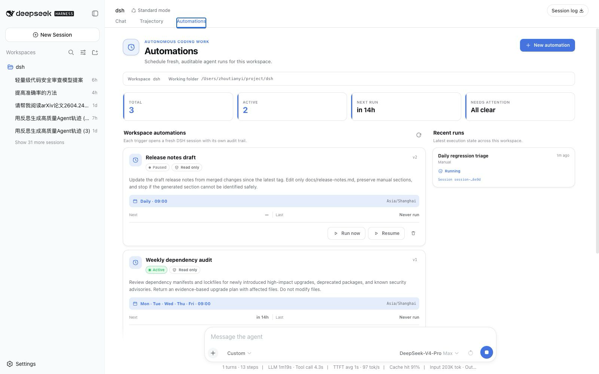
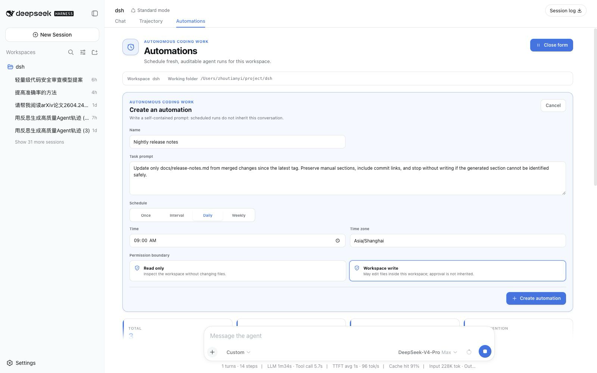
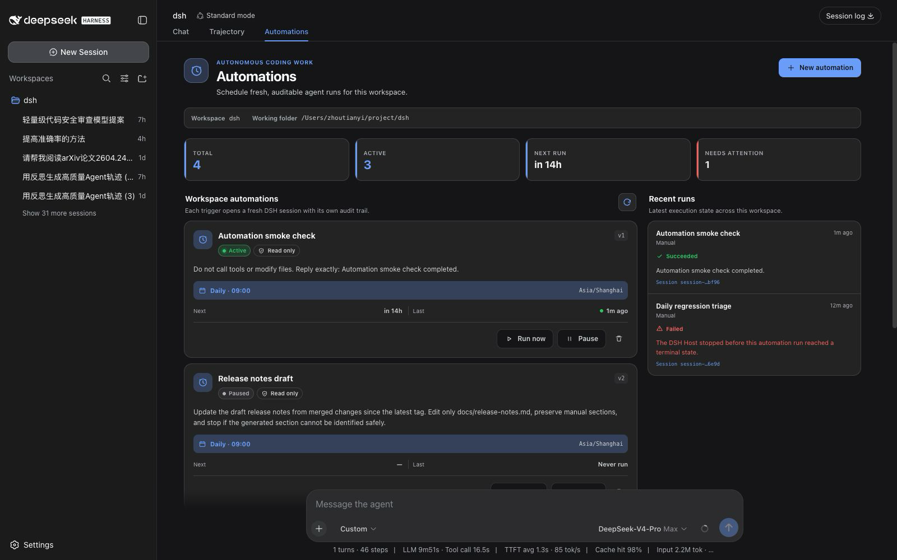
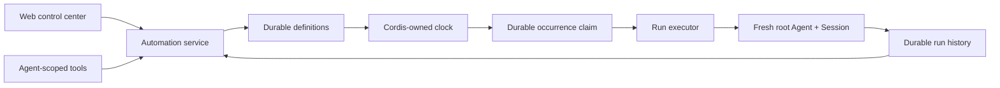

<div align="center">

# dsh-automation

### Coding work that runs later — inside DSH, in a fresh auditable session.

[](https://github.com/dsh-external)
[](package.json)
[](package.json)
[](LICENSE)

**English** · [简体中文](README.zh-CN.md)

[Install](#install) · [What it does](#what-it-does) · [Use cases](#use-cases-that-earn-their-schedule) · [Safety](#a-schedule-is-not-permission) · [Architecture](#codex-inspired-dsh-native)

</div>

`dsh-automation` gives DeepSeek Harness a native automation control center and Agent-callable scheduling tools. Define a self-contained coding task once; DSH persists the intent, claims each due occurrence, starts a **fresh root Agent and Session**, and keeps the outcome as run history.

It is intentionally not a cron wrapper around a prompt:

> **Automation = durable intent + an explicit execution boundary + an auditable run.**



## Why this exists

DSH already has a core Schedule feature for reminders in the current conversation. That is the right tool for “come back to this Session in ten minutes.” Automation solves a different job: “run this complete task independently every weekday and leave me a result I can inspect.”

| | Core DSH Schedule | dsh-automation |
| --- | --- | --- |
| Execution context | Returns to the same live Agent | Starts a fresh root Agent and Session |
| Prompt | A follow-up inside existing context | A saved, self-contained task |
| Scope | Current Session Log | One canonical DSH workspace |
| History | Conversation events | Definition revisions and durable run records |
| Best for | Reminders and same-chat follow-ups | Repeated or one-shot standalone coding work |

If a task depends on unstated chat history, needs an interactive approval halfway through, or should react to a file/HTTP/process condition rather than time, it is not a good automation yet.

## What it does

### One control plane, two ways in

- **From DSH Web:** open the **Automations** conversation tab to create a rule, pause or resume it, run it now, delete it, and inspect recent runs.
- **From any root Agent:** ask in natural language. Six scoped tools let the Agent create, list, update, delete, run, and inspect automations for its exact workspace.

There is no separate bot, daemon UI, or third-party scheduler to operate.

### Schedules people can read

Create a one-shot, fixed interval, daily, or weekly rule. Daily and weekly schedules use a real IANA time zone; the friendly form is normalized into a validated RFC 5545 RRULE for persistence and inspection.



### Every trigger is a clean execution boundary

Each due occurrence receives:

- a new Session ID and fresh root Agent;
- the saved prompt, not the source conversation history;
- the captured workspace, cwd, Agent preset, model target, and permission preset;
- an explicit `automation` message source containing the automation ID, run ID, and scheduled time;
- a terminal result derived from the actual DSH turn end, not merely “message delivered.”

### History that explains failure, not just success

Runs progress through `queued`, `running`, and a terminal state such as `succeeded`, `failed`, `skipped`, or `cancelled`. The record keeps its definition revision, prompt and target snapshot, scheduled time, result Session ID, bounded summary, and structured error.



Deleting a definition does not immediately erase its bounded durable run records. Updating a definition increments its revision, so every retained run still says exactly what it executed. Retention removes only the oldest terminal records; queued and running records are never pruned.

## Use cases that earn their schedule

The useful automations are boring, repeatable, and easy to verify. Examples:

| Automation | Suggested boundary | Why it is useful |
| --- | --- | --- |
| Weekday regression triage | `read-only` | Inspect the latest local test evidence, group failures, and leave a concise diagnosis in a new Session. |
| Weekly repository health report | `read-only` | Review stale TODOs, dependency manifests, ignored failures, and test gaps without changing the tree. |
| One-shot verification | `read-only` | Recheck a flaky failure in 30 minutes and record the evidence independently of the current chat. |
| Generated-code refresh | `workspace-write` | Rebuild a known generated artifact, run its focused checks, and report the exact diff. |
| Maintenance fix window | `workspace-write` | Reproduce one bounded issue, make the smallest verified fix, and stop when the acceptance checks pass. |

A strong automation prompt includes the goal, evidence to inspect, allowed changes, verification, and stopping condition:

```text
Every weekday, inspect the authentication package's latest local test results.
Group failures by root cause and identify regressions introduced by the current tree.
Do not modify files. Report the failing tests, supporting evidence, and the smallest
next action. If there are no failures, say so explicitly.
```

Avoid prompts such as “continue what we discussed” or “fix everything.” Scheduled runs do not inherit the conversation that created them.

## Install

Install the GitHub bundle into the DSH Web profile, then restart `dsh web`:

```bash
dsh plugin --profile web add github:dsh-external/dsh-automation#v0.1.0
```

The version tag keeps the install reproducible; a reviewed commit SHA is equally valid. If you run DSH from its source checkout, use `pnpm dsh` in place of `dsh`.

After restart:

1. Open a Session attached to the workspace you want to automate.
2. Select the **Automations** tab next to Chat and Trajectory.
3. Create a self-contained task, schedule, IANA time zone, and permission boundary.
4. Use **Run now** once before relying on the schedule; inspect the resulting Session and run record.

<details>
<summary><strong>Install from a local checkout</strong></summary>

Node.js 22.19 or newer is required.

```bash
git clone https://github.com/dsh-external/dsh-automation.git
cd dsh-automation
pnpm install
pnpm check

cd /path/to/deepseek-harness
pnpm dsh plugin --profile web add /absolute/path/to/dsh-automation
```

Git-based plugin installation runs the package's `prepare` script. With pnpm build-script restrictions enabled, allow the reviewed `@dsh-external/dsh-automation` package to build.

</details>

## Let an Agent configure it

Once installed, the tools are mounted into eligible root Agents. You can ask:

```text
Create a read-only automation called "Weekday regression triage" for this workspace.
Run it Monday through Friday at 09:30 in Asia/Shanghai. Each fresh run should inspect
the latest local test evidence, identify regressions, and return a short report with
file and test references. Do not modify files.
```

The Agent can call:

| Tool | Purpose |
| --- | --- |
| `automation_create` | Create a workspace-bound standalone rule. |
| `automation_list` | Read rules, next occurrences, and recent history. |
| `automation_update` | Change name, prompt, cadence, permission, or active/paused state. |
| `automation_run_now` | Queue one manual occurrence with the same boundary. |
| `automation_runs` | Read bounded run history, errors, summaries, and Session IDs. |
| `automation_delete` | Delete the definition while retaining durable run records. |

Plugin-level approval asks for human confirmation when an Agent creates or expands unattended future work. Read operations and a pause-only update do not add that extra approval step.

## A schedule is not permission

Unattended coding needs a smaller trust boundary than an interactive chat. `dsh-automation` therefore makes the following guarantees explicit:

- **No inherited authority.** A run receives no source-chat history, inbox, grant, or past approval.
- **Two permission modes only.** Rules may use `read-only` or `workspace-write`; unattended `danger-full-access` is not accepted.
- **Fail closed.** Each fresh Session uses approval policy `never`. A tool that still requires interactive approval fails instead of waiting forever or silently escalating.
- **Exact workspace scope.** Agent tools bind to the caller's canonical registered workspace; callers cannot supply an arbitrary target path.
- **Explicit capability allowlist.** The fresh Agent admits a small coding-tool set. Interactive questions, plans, goals, nested Agents, runtime plugin mounting, terminal/background jobs, recursive automation management, and unknown third-party tools are denied by an Agent-scoped final guard.
- **Loopback Web control.** The management RPC channel accepts loopback authority only.
- **Traceable origin.** The task enters the Session with `source.kind = automation`, plus the automation/run identity and scheduled time. It never impersonates a human message.
- **No blind retries.** Once an Agent may have produced side effects, the plugin does not automatically retry it.

These boundaries do not turn every third-party DSH tool into a sandbox. Foreground shell and network behavior still depends on the selected Agent preset, tool set, and DSH guards. Review a task with **Run now** before enabling unattended writes.

## Scheduling and recovery semantics

The behavior is deliberately predictable:

| Situation | Behavior |
| --- | --- |
| Interval | Minimum five minutes; the first run occurs after one full interval, not immediately. |
| Daily / weekly | Evaluated at local `HH:mm` in an explicit IANA zone; nonexistent DST wall times are skipped rather than shifted. |
| Overlap | One active run per automation. A due occurrence is recorded as `skipped(overlap)` if its previous run is queued or running. |
| Host restarts late | Within the grace window (15 minutes by default), only the latest due occurrence can catch up. Older work is not replayed as a write backlog. |
| Run timeout | The Agent is cancelled after 60 minutes by default and the run is recorded as failed. |
| Host crash | Persisted `queued` or `running` records become `failed(host_interrupted)` on recovery; they are not secretly re-executed. |
| Retry | Manual **Run now** only. There is no automatic side-effect retry. |

A deterministic occurrence key prevents the scheduler from dispatching the same recorded occurrence twice. This is an **at-most-once dispatch policy**, not a claim that external side effects are exactly once.

The DSH Host must be running for a task to start. Version 0.1 is not an operating-system daemon and does not coordinate multiple Hosts over one storage directory.

## Codex-inspired, DSH-native

The product model is inspired by Codex [Scheduled tasks](https://learn.chatgpt.com/docs/automations), especially its distinction between a task that returns to a chat and a standalone task that starts a new run. The implementation is native to DSH and Cordis; it does not copy Codex internals or patch DSH Core.



| Layer | Owns | Does not own |
| --- | --- | --- |
| Definition/run store | Durable facts and revision snapshots | Timers or Agents |
| Clock | Finding the next due occurrence | Prompts, permissions, or execution |
| Executor | One already-claimed fresh Agent run | Schedule mutation |
| Agent tools / Web RPC | Validated service calls | Tables, timers, or direct Agent construction |
| Web client | Native `conversation.view` presentation | Authoritative due state |

Cordis disposal stops the clock, cancels plugin-owned live handles, removes tools/RPC/UI, and closes storage without inventing a successful run. The full rationale and data model are in the [design document](docs/DESIGN.zh-CN.md).

## Configuration

The included `cordis.patch.yml` uses conservative defaults:

| Option | Default | Meaning |
| --- | ---: | --- |
| `maxConcurrentRuns` | `2` | Global execution capacity for this Host. Per-automation overlap is still disabled. |
| `runTimeoutMinutes` | `60` | Maximum wall-clock time for one fresh Agent run. |
| `misfireGraceMinutes` | `15` | How late the latest due occurrence may catch up after downtime. |
| `historyLimit` | `200` | Durable terminal-run retention per automation; active records are always kept. |

Edit the plugin row in the deployment profile if you need different values. Increasing concurrency or timeout expands the amount of unattended work; treat those changes as policy decisions.

## Current limits

Version 0.1 deliberately does not provide:

- same-chat heartbeats — use DSH Core Schedule;
- raw cron or arbitrary shell actions;
- unattended full access;
- automatic retry of a run that may have side effects;
- Git worktree creation or cleanup;
- multi-workspace targets, DAGs, or hidden cross-run memory;
- external email, SMS, or push delivery;
- a guarantee of exactly-once external side effects.

Only local execution is implemented. A stable DSH worktree lifecycle service should exist before a UI toggle claims worktree isolation.

## Development

```bash
pnpm typecheck
pnpm test
pnpm build
# or all three
pnpm check
```

The package builds a Host ESM bundle and a Web client bundle for DSH's `window.__ModuleLoader__` contract. Tests cover recurrence and DST behavior, durable-domain invariants, Agent capability guards, scheduler overlap/recovery/retention, and client schedule/localization helpers.

## License

[MIT](LICENSE). This is an independent community plugin for DeepSeek Harness. “Codex” is referenced only to describe the product pattern that informed the design.
