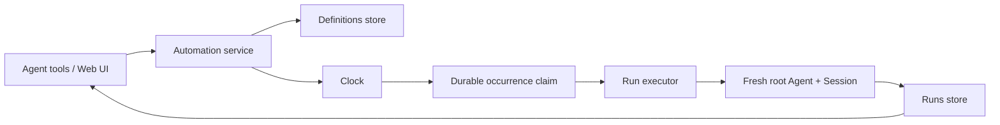

# dsh-automation 设计文档

> 状态：MVP implementation contract
> 版本：0.1
> 日期：2026-08-13

## 1. 问题与产品边界

DeepSeek Harness 已经有 `@deepseek-ai/dsh-schedule`：它把一次提醒持久化在**当前 Session Log** 中，到期后回到同一个 live Agent。它适合“十分钟后继续检查”，但不是后台自动化平台：它不会冷启动 workspace，不会为每次运行创建独立会话，也不保存跨运行的结果历史。

`dsh-automation` 解决另一类问题：

- 每天 09:00 检查依赖安全更新，并把结果保存在一条新的 DSH 会话中；
- 每周一生成 repository health report；
- 30 分钟后独立执行一次已经自包含的 coding task；
- 由用户、Agent 或 Skill 创建规则，之后由 Host 在无人值守的边界上执行。

它不取代：

- Core Schedule 的同会话 reminder；
- `dsh-loop` 的临时循环；
- `dsh-sentinel` 的文件、HTTP、进程等条件触发；
- workflow/DAG 执行器。

一句话定义：

> **Automation = 持久意图（durable intent）+ 明确的执行边界（explicit execution boundary）+ 可审计运行（auditable run），而不是 cron + prompt。**

## 2. 从 Codex Automations 迁移什么

OpenAI 的 [Scheduled tasks](https://learn.chatgpt.com/docs/automations) 把产品分成两种语义：

1. **Scheduled task in a chat**：回到原对话，继续使用已有上下文；
2. **Standalone scheduled task**：每次触发都创建一次新的 run/chat，从保存的 prompt 开始，结果进入 Scheduled inbox。

Codex 还把 schedule、project、local/worktree 执行环境、model/reasoning、run history 和通知分开；规则可以由对话或 Skill 创建和更新。高级 cadence 使用 RFC 5545 RRULE。

DSH 的迁移决策：

| Codex 概念 | DSH 映射 | MVP 决策 |
|---|---|---|
| Scheduled task in a chat | Core `dsh-schedule` | 不重复实现 |
| Standalone task | fresh root Agent + fresh Session | 本插件核心 |
| Project | `WorkspaceId` + canonical cwd | 一条规则只绑定一个 workspace |
| Local / worktree | executor target | MVP 只支持 local；不伪造 worktree |
| RRULE | `schedule.rrule` | friendly builder 生成、持久化并校验 |
| Scheduled inbox | durable `AutomationRun` | Web Runs 列表 + unread 状态 |
| Notification | delivery projection | 不影响运行和历史；MVP 不发送外部通知 |

Codex 未公开 overlap、misfire、retry 和 exactly-once 的完整策略，因此这些不是“兼容事实”。DSH 必须自己写清楚。

## 3. 设计原则

### 3.1 没有拥有一切的 Automation 单体



- **Store** 只拥有 definition/run 的 durable state；
- **Clock** 只回答“哪个 occurrence 到期”，不创建 Agent；
- **Executor** 只消费已经持久化 claim 的 run；
- **Tools / Web** 只调用 service，不直接改表、不自己设 timer；
- **Client** 只读 Host snapshot 并提交明确 mutation。

这是 Cordis 的解耦点：每个能力通过 service 和 disposer 组合，插件卸载会停止 clock、取消由它拥有的 Agent handle、移除 tools/RPC/UI，但不会把已持久化规则假装成已执行。

### 3.2 模型可见就必须可追溯

自动化 prompt 以 `user/message` 进入新会话，但 source 是：

```ts
{
  kind: 'automation',
  automationId,
  runId,
  scheduledFor
}
```

它不是 `source.kind = 'user'`。创建者、definition revision、prompt snapshot、scheduled occurrence 和最终 SessionId 都保留在 durable record 中。

### 3.3 Schedule 不是授权

创建规则只表达未来意图，不缓存一次性批准。每次 run：

- 创建 fresh Agent，不继承来源 Session 的 inbox、历史、grant 或 approval；
- 重新解析当前 workspace 与 preset；
- 只允许 `read-only` 或 `workspace-write`；MVP 禁止 `danger-full-access`；
- 无人值守 run 使用 fail-closed approval policy，不能永久等待一个不存在的人；
- Agent-scoped final guard 采用显式 Coding tool allowlist，默认拒绝未知第三方工具，以及交互式问题、目标/计划、嵌套 Agent、运行时插件挂载、终端/后台任务和递归 automation 管理；
- preset 无法挂载、workspace 消失或策略不可用时，run 失败并保留证据。

## 4. Durable model

### 4.1 AutomationDefinition

```ts
interface AutomationDefinition {
  version: 1
  id: string
  revision: number
  name: string
  prompt: string
  status: 'active' | 'paused'
  schedule: Once | Interval | Daily | Weekly
  rrule: string
  timeZone: string
  workspaceId: string
  cwd: string
  agentPreset: string
  provider?: string
  model?: string
  permissionPreset: 'read-only' | 'workspace-write'
  createdBy: { kind: 'agent' | 'web'; sessionId: string }
  createdAt: string
  updatedAt: string
}
```

`nextRunAt` 是由 rule 和当前时间计算的 projection，不是第二份权威。每次更新递增 revision；已经开始的 run 始终保留当时的 prompt/target snapshot。

### 4.2 AutomationRun

```ts
interface AutomationRun {
  version: 1
  id: string
  automationId: string
  definitionRevision: number
  occurrenceKey: string
  trigger: 'schedule' | 'manual'
  scheduledFor: string
  status: 'queued' | 'running' | 'succeeded' | 'failed' | 'skipped' | 'cancelled'
  promptSnapshot: string
  targetSnapshot: { workspaceId: string; cwd: string; agentPreset: string }
  sessionId?: string
  startedAt?: string
  finishedAt?: string
  summary?: string
  error?: { code: string; message: string }
  unread: boolean
}
```

`occurrenceKey = automationId + definitionRevision + scheduledFor`，并映射到稳定 run id。同一 due occurrence 即使 clock 在重启后再次扫描，也只能对应同一条 record。

Definitions 和 runs 分表：删除规则不会抹掉历史；通知偏好不会影响执行事实。

Terminal run history 按 automation 做有界持久化（默认每条保留 200 条），queued/running 记录永不因 retention 被裁剪。Automation Session 使用插件保留的稳定 SessionId 前缀；第一条消息还携带 `source.kind = 'automation'`。即使 Agent 在写入 prompt 前失败，或旧 run record 后来被裁剪，恢复该 Session 时也不会错误获得 automation 管理工具。

Terminal run record 先写入 domain；部署显式设置 `archiveRunSessions: true` 后，插件再通过 DSH 正式的 `workspaceRegistry.archiveSession` API 将结果 Session 从普通会话列表归档。归档只修改 registry-global archive set，不删除 Session Log，也不移除 workspace accounting；AutomationRun 持续保存 SessionId、summary 与 error 作为审计入口。归档失败只记录 warning，不把已经完成的 Agent turn 改写成 failed；Host 启动恢复会在 history pruning 前再次尝试归档所有仍有 SessionId 的 terminal records。当前 Harness 尚无 unarchive API，Client 因此把已归档结果显示为不可点击状态；默认 `archiveRunSessions: false` 保留完整 Session 打开行为。

## 5. 调度语义（MVP 明确承诺）

### 5.1 Cadence

- Once：一个带 offset 的未来 instant；
- Interval：最短 5 分钟，以创建/指定 anchor 固定速率；
- Daily：明确本地时间 + IANA timezone；
- Weekly：工作日集合 + 本地时间 + IANA timezone；
- friendly form 编译为 RFC 5545 RRULE；DST 由 timezone-aware recurrence 计算。

### 5.2 Overlap

同一 automation 同时最多一个 running。下一个 occurrence 到期时若上一条仍在运行，持久化 `skipped(overlap)`，不隐式并发，也不积压第二个 writer。

### 5.3 Misfire

Host 只有在 DSH 进程运行时才能执行。重启后：

- grace window（默认 15 分钟）内，最多 catch up 最新一次；
- 只物化最新一条 overdue occurrence；更老的 backlog 不创建 run record；
- 不补跑一串会修改代码的历史任务；用户可以 Run now。

### 5.4 Retry

Agent 已经开始后不自动重试，因为任务可能有副作用。启动前的暂时性创建失败也以明确失败记录结束；用户可 Run again。这个选择比“可能重复修改 workspace”更安全。

### 5.5 Crash recovery

触发顺序是：

1. 先以稳定 occurrence key 持久化 `queued`；
2. 再创建 Agent，并更新 `running + sessionId`；
3. 等待 fresh Agent idle，读取真实 turn end；
4. 写 `succeeded/failed`；
5. dispose Agent handle。

进程重启时，遗留 `queued/running` 变为 `failed(interrupted)`；不会偷偷重跑可能已经产生副作用的任务。该设计提供 **at-most-once dispatch per recorded occurrence**，但不宣称外部副作用 exactly-once。

## 6. Agent execution boundary

执行器只从 root Cordis context 调用：

```ts
ctx.agents.withoutInitiator(() => ctx.agents.create({
  sessionId,
  meta: { cwd, agentPreset },
  agentOptions: { provider, model },
  setup: async (agentCtx) => {
    await ctx.agentPresets.mount(agentCtx, agentPreset)
    // Pin current unattended policy before publication.
  },
}))
```

创建完成后先把 Session attach 到原 Workspace，再发送 automation-sourced prompt。`whenIdle()` 只能表示整个 Agent 静止，因此 MVP 刻意让一个 fresh Agent 只消费这一条 automation work；这样该 Agent 的第一段 consumed-work interval 就等于本次 run。

结果从 durable turn/end 与最后一个 assistant message 派生，而不是把“消息已投递”误报为成功。

## 7. Agent-facing tools

MVP 提供：

- `automation_create`：在当前 Agent 的 workspace 创建独立规则；
- `automation_list`：列出当前 workspace 的规则和 next run；
- `automation_update`：改名称、prompt、cadence 或 pause/resume；
- `automation_delete`：删除定义，保留 runs；
- `automation_run_now`：创建 manual occurrence；
- `automation_runs`：读取 bounded history。

每个 mutation 只接受结构化参数，不接收 raw shell command。Agent 只能绑定自己的 canonical workspace，不能借参数越界到任意路径；`workspace-write` 必须显式选择。

## 8. Web product

Web client 注册一个 session-scoped `Automations` conversation view：

- overview：Active / Paused / Needs attention / Runs；
- rule cards：cadence、workspace、next run、last outcome；
- create/edit：Once / Every / Daily / Weekly 的友好表单；
- actions：Pause/Resume、Run now、Delete；
- run history：queued/running/succeeded/failed/skipped、时间、summary、SessionId。

UI 不自己计算权威 due state；它通过 loopback-trusted Connection RPC 获取 Host snapshot。Client 卸载只移除 tab，不影响 durable rules。

## 9. 非目标

MVP 不做：

- 同会话 heartbeat（交给 Core Schedule）；
- raw cron editor；
- arbitrary shell action；
- full-access unattended task；
- Git worktree lifecycle；
- 多 workspace target；
- 外部 email/SMS/push notification；
- DAG/workflow；
- 隐式跨 run memory；
- exactly-once 外部副作用承诺。

## 10. 验收条件

1. Agent 和 Web 都能创建、查看、暂停、恢复、更新、删除规则；
2. 到期后创建新的 root Session，source 明确是 automation；
3. definition、run 和 run Session 在重启后仍可检查；
4. 同一 occurrence 不会启动两次；overlap/misfire 有独立记录；
5. 更新规则后旧 run 仍显示旧 revision 和 prompt snapshot；
6. 收紧当前策略后，下一次运行不会沿用旧批准；
7. workspace/preset 缺失、timeout、模型失败都成为可读 run failure；
8. pause 不触发；resume 从未来 occurrence 继续，不制造补跑洪峰；
9. 删除 definition 不删除历史；
10. DSH Web 中英文、浅色/深色、空态/失败态/窄屏均可用；
11. Cordis unload 后 timer、RPC、tools、Agent handles、client slots 无泄漏。

## 11. 已知边界

- Host 进程必须运行；MVP 不是 OS daemon；
- storage-domain 是单进程一致性边界；MVP 不支持多个 DSH Host 同时争抢同一 store；
- DSH sandbox 主要约束文件 effects，network/process 仍取决于挂载 preset 的工具与 guard；
- full worktree isolation 需要稳定的 worktree lifecycle service，不能用 UI 开关伪装。
